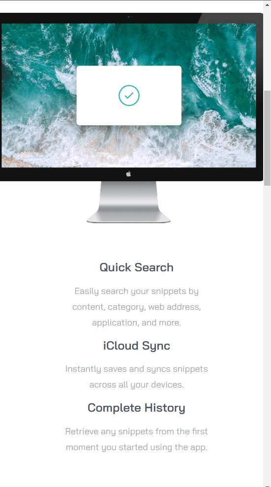

# Frontend Mentor - Clipboard landing page app solution

This is a solution to the [Clipboard landing page app challenge on Frontend Mentor](https://www.frontendmentor.io/challenges/clipboard-landing-page-5cc9bccd6c4c91111378ecb9). Frontend Mentor challenges help you improve your coding skills by building realistic projects.

## Table of contents

- [Overview](#overview)
  - [The challenge](#the-challenge)
  - [Screenshot](#screenshot)
  - [Links](#links)
- [My process](#my-process)
  - [Built with](#built-with)
  - [Useful resources](#useful-resources)
- [Author](#author)

## Overview

### The challenge

Users should be able to:

- View the optimal layout for the app depending on their device's screen size

### Screenshot

### Links

- Solution URL: [Github](https://github.com/rishabh2011/Tip-Calculator-)
- Live Site URL: [Site](https://rishabh2011.github.io/Tip-Calculator-/)

## My process

### Built with

- HTML5 markup
- CSS 
- Bootstrap

### Useful resources

- [MDN Web Docs](https://developer.mozilla.org/en-US/)
- [Stack Overflow](https://stackoverflow.com/)
- [Bootstrap](https://getbootstrap.com/) 

## Author

- Website - [Rishabh Choudhury](https://github.com/rishabh2011)
- Frontend Mentor - [@rishabh2011](https://www.frontendmentor.io/profile/rishabh2011)